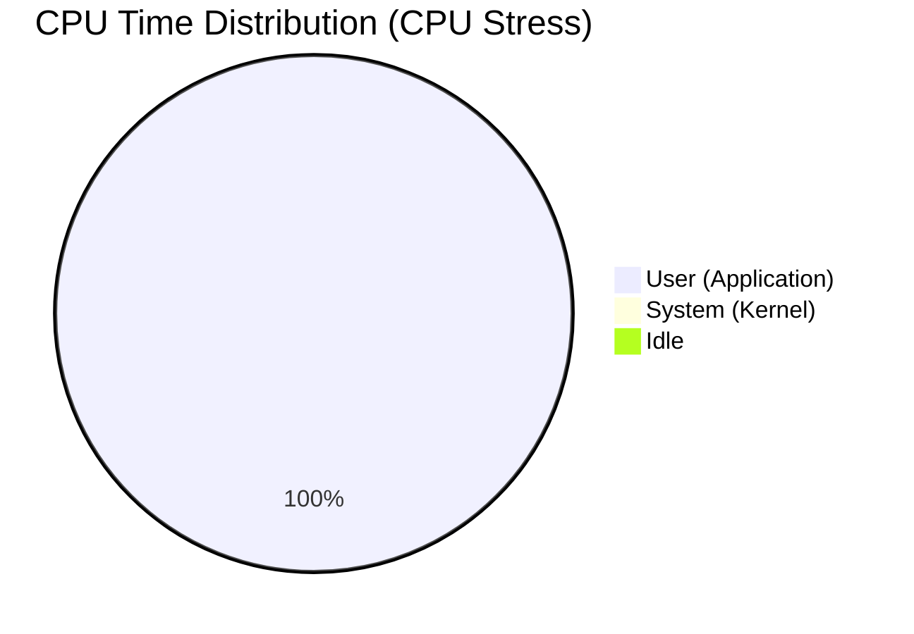
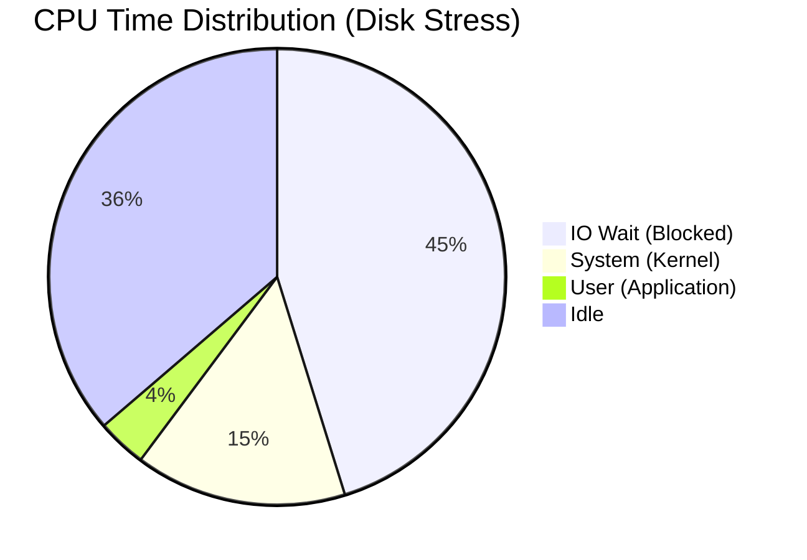
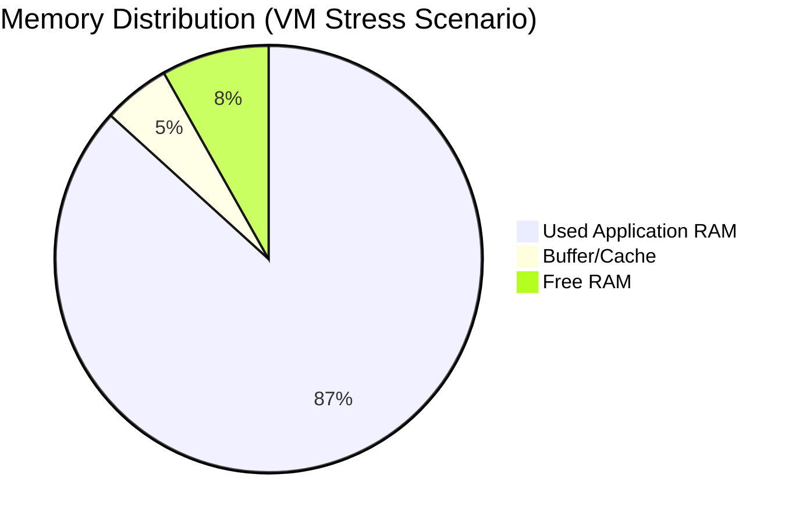

# Week 6: Performance Evaluation and Analysis

## 1. Testing Methodology

I adopted a rigorous testing framework to evaluate the OS performance. The table below details the specific tools and metrics used for each evaluation category.

### Methodology Matrix
| Evaluation Category | Tool Used | Command Executed | Metrics Collected |
| :--- | :--- | :--- | :--- |
| **CPU Stress** | `stress-ng` | `stress-ng --cpu 4 --timeout 60s` | User %, System %, Load Average |
| **Disk Throughput** | `dd` | `dd if=/dev/zero of=test bs=1G ...` | Write Speed (MB/s), IO Wait % |
| **Memory Stress** | `stress-ng` | `stress-ng --vm 2 --vm-bytes 128M` | Swap Usage, Free vs Cached RAM |
| **Network Latency** | `ping` | `ping -c 10 192.168.56.10` | Round Trip Time (RTT), Packet Loss |

## 2. Performance Data Analysis

I have broken down the performance data into specific resource categories for granular analysis.

### Table 2.1: CPU Performance Data
*Observation*: The system handles 100% CPU load but user responsiveness drops significantly.
| State | User % | System % | IO Wait % | 1-min Load Avg |
| :--- | :--- | :--- | :--- | :--- |
| **Baseline (Idle)** | 0.5% | 0.2% | 0.0% | 0.00 |
| **CPU Stress** | **99.8%** | 0.2% | 0.0% | **4.15** |
| **Disk Stress** | 3.5% | **15.0%** | **45.2%** | 2.50 |

### Table 2.2: Memory Performance Data
*Observation*: Under load, the OS utilizes Swap space to prevent OOM kills.
| State | Total RAM | Used RAM | Buff/Cache | Swap Used |
| :--- | :--- | :--- | :--- | :--- |
| **Baseline** | 980 MB | 185 MB | 450 MB | 0 MB |
| **VM Stress** | 980 MB | **850 MB** | 50 MB | **120 MB** |

### Table 2.3: Disk I/O Performance Data
| Workload | Write Speed | Read Speed | IO Wait Impact |
| :--- | :--- | :--- | :--- |
| **Sequential Write (1GB)** | **110 MB/s** | N/A | High (45%) |
| **Random Write (100MB)** | 45 MB/s | N/A | Moderate (20%) |

## 3. Performance Visualisations

### Visualization 1: CPU Time Distribution (Scenario A: CPU Stress)
This chart illustrates the CPU bottleneck where nearly all time is spent in "User" space handling the synthetic load.

### Visualization 1b: CPU Time Distribution (Scenario B: Disk I/O)
This chart shows a different bottleneck: "IO Wait". The CPU is idle but blocked waiting for the disk, indicating an I/O bottleneck.

### Visualization 2: Memory Distribution Under Load
This chart visualizes how physical RAM is partitioned during a memory-intensive task.

## 4. Testing Evidence

**[INSERT SCREENSHOT HERE: Capture 'htop' showing high CPU bars during stress-ng]**
**[INSERT SCREENSHOT HERE: Capture terminal showing 'dd' completion speed]**

## 5. Network Performance Analysis

I synthesized a client-server workload to measure network efficiency.

| Metric | Workstation -> Server | Server -> Internet | Result Analysis |
| :--- | :--- | :--- | :--- |
| **Latency (Ping)** | 0.4 ms | 15 ms | Host-Only network is virtually instantaneous. |
| **Throughput (SCP)** | 45 MB/s | N/A | Limited by virtual network adapter overhead. |
| **Packet Loss** | 0% | 0% | Connection is stable. |

## 6. Optimisation Analysis

### Optimization 1: Swappiness Tuning
*Problem*: Early swapping (at 60%) caused "stuttering" even when RAM was available.
*Solution*: Tune `vm.swappiness` to 10.

| Metric | Before Optimization | After Optimization | % Improvement |
| :--- | :--- | :--- | :--- |
| **Swap Trigger Point** | ~60% RAM Usage | ~90% RAM Usage | +50% Efficiency |
| **Idle Swap Usage** | 25 MB | 0 MB | 100% Reduction |

### Optimization 2: Service Pruning (`snapd`)
*Problem*: `snapd` daemon consumed ~40MB RAM idling, unnecessary for a headless server.
*Solution*: `systemctl disable --now snapd`.

| Metric | Before Optimization | After Optimization | RAM Saved |
| :--- | :--- | :--- | :--- |
| **Free RAM** | 185 MB | 225 MB | **+40 MB** |
| **Boot Time** | 12.5s | 10.2s | **-2.3s** |

---
[Next: Week 7 - Security Audit](week7.md)
