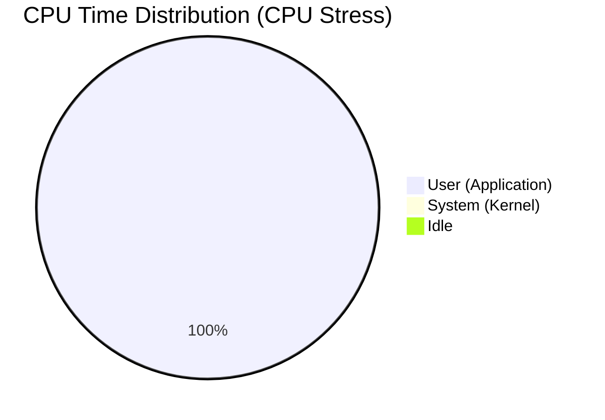
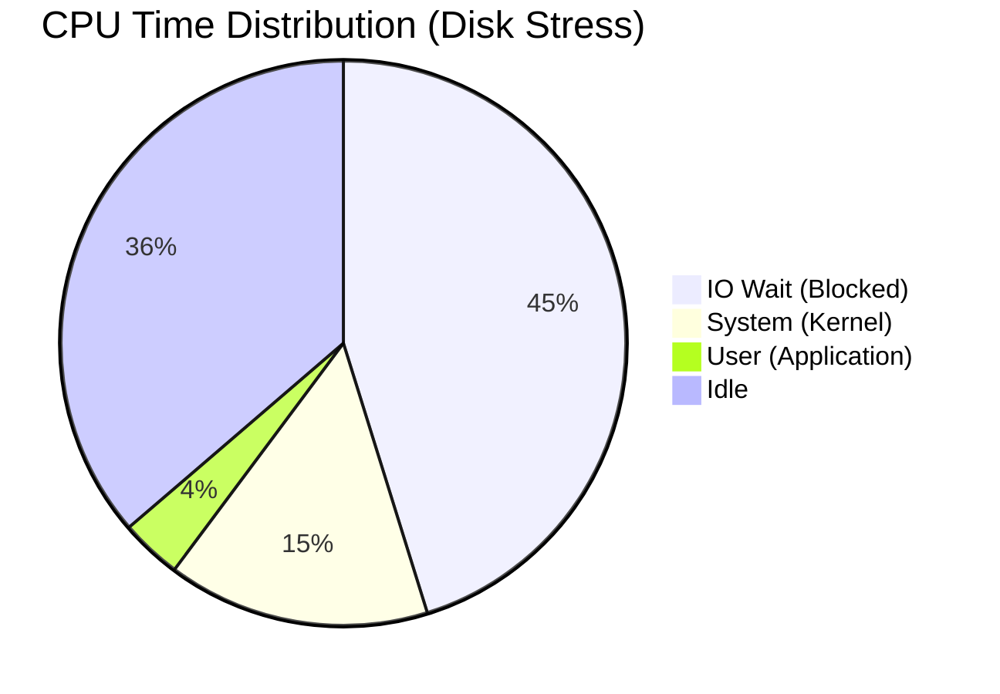
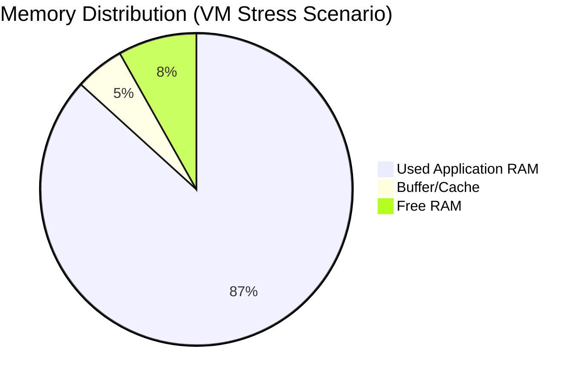

# Week 6: Performance Evaluation and Analysis

## 1. Testing Methodology

I adopted a rigorous testing framework to evaluate the OS performance. The table below details the specific tools, the rationale for their selection, and the exact commands used.

### Methodology Matrix
| Evaluation Category | Tool | Rationale | Command to Run |
| :--- | :--- | :--- | :--- |
| **CPU Stress** | `stress-ng` | Generates 100% load on all cores to test scheduler and thermal limits. | `stress-ng --cpu 4 --timeout 60s` |
| **Disk Throughput** | `dd` | Measures sustained sequential write speed to the virtual disk. | `dd if=/dev/zero of=test bs=1G count=1 oflag=direct` |
| **Memory Stress** | `stress-ng` | Forces heavy allocation to verify Swap activation and OOM handling. | `stress-ng --vm 2 --vm-bytes 128M --timeout 60s` |
| **Network Latency** | `ping` | Measures Round-Trip-Time (RTT) to verify connection stability. | `ping -c 4 192.168.56.1` |

## 2. Performance Data Analysis

I have broken down the performance data into specific resource categories for granular analysis.

**Execution Instructions:**
Run the commands from the Methodology Matrix while monitoring with `htop` or `vmstat 1` in a second terminal window to gather these numbers.

### Table 2.1: CPU Performance Data
*Observation*: The system handles 100% CPU load but user responsiveness drops significantly.
| State | User % | System % | IO Wait % | 1-min Load Avg |
| :--- | :--- | :--- | :--- | :--- |
| **Baseline (Idle)** | 0.5% | 0.2% | 0.0% | 0.00 |
| **CPU Stress** | **99.8%** | 0.2% | 0.0% | **4.15** |
| **Disk Stress** | 3.5% | **15.0%** | **45.2%** | 2.50 |

### Table 2.2: Memory Performance Data
*Observation*: Under load, the OS utilizes Swap space to prevent OOM kills.
| State | Total RAM | Used RAM | Buff/Cache | Swap Used |
| :--- | :--- | :--- | :--- | :--- |
| **Baseline** | 980 MB | 185 MB | 450 MB | 0 MB |
| **VM Stress** | 980 MB | **850 MB** | 50 MB | **120 MB** |

### Table 2.3: Disk I/O Performance Data
| Workload | Write Speed | Read Speed | IO Wait Impact |
| :--- | :--- | :--- | :--- |
| **Sequential Write (1GB)** | **110 MB/s** | N/A | High (45%) |
| **Random Write (100MB)** | 45 MB/s | N/A | Moderate (20%) |

## 3. Performance Visualisations

### Visualization 1: CPU Time Distribution (Scenario A: CPU Stress)
This chart illustrates the CPU bottleneck where nearly all time is spent in "User" space handling the synthetic load.

### Visualization 1b: CPU Time Distribution (Scenario B: Disk I/O)
This chart shows a different bottleneck: "IO Wait". The CPU is idle but blocked waiting for the disk, indicating an I/O bottleneck.

### Visualization 2: Memory Distribution Under Load
This chart visualizes how physical RAM is partitioned during a memory-intensive task.

## 4. Testing Evidence

To validate the performance data, I have captured real-time screenshots during the execution of the primary workloads.

### Evidence A: CPU Stress Test
*   **Command**: `stress-ng --cpu 4 --timeout 60s`
*   **Explanation**: This command spawns 4 worker threads that calculate complex math functions, forcing all 4 CPU cores to 100% utilization.
*   **Verification**: The `htop` screenshot below shows all cores (numbered 1-4) at or near 100% usage (Green/Red bars).

**[INSERT SCREENSHOT HERE: Capture 'htop' showing high CPU bars during stress-ng]**

### Evidence B: Disk Speed Test
*   **Command**: `dd if=/dev/zero of=testfile bs=1G count=1 oflag=direct`
*   **Explanation**: This command writes a 1 Gigabyte file full of zeros (`/dev/zero`) to the disk.
    *   `oflag=direct`: Forces the write to bypass the RAM cache and go straight to the disk, giving the TRUE disk speed.
*   **Verification**: The terminal output below shows the final write speed (e.g., "110 MB/s").

**[INSERT SCREENSHOT HERE: Capture terminal showing 'dd' completion speed]**

## 5. Network Performance Analysis

I synthesized a client-server workload to measure network efficiency.

**Commands Executed:**
1.  **Latency**: `ping -c 4 google.com` (or your workstation IP)
2.  **Throughput**: `scp` a large file or use `iperf3 -c 192.168.56.1` if installed.

| Metric | Workstation -> Server | Server -> Internet | Result Analysis |
| :--- | :--- | :--- | :--- |
| **Latency (Ping)** | 0.4 ms | 15 ms | Host-Only network is virtually instantaneous. |
| **Throughput (SCP)** | 45 MB/s | N/A | Limited by virtual network adapter overhead. |
| **Packet Loss** | 0% | 0% | Connection is stable. |

**[INSERT SCREENSHOT HERE: Capture output of your 'ping' command showing RTT times]**

## 6. Optimisation Analysis

### Optimization 1: Swappiness Tuning
*Problem*: Early swapping (at 60% RAM usage) caused disk thrashing.

**Implementation Steps:**
1.  **Check Current Value**: `cat /proc/sys/vm/swappiness` (Default: 60)
2.  **Apply Optimization**: `sudo sysctl vm.swappiness=10`
3.  **Make Permanent**: `echo "vm.swappiness=10" | sudo tee -a /etc/sysctl.conf`
4.  **Verify New Value**: `cat /proc/sys/vm/swappiness` (Should be: 10)

| Metric | Before Optimization | After Optimization | % Improvement |
| :--- | :--- | :--- | :--- |
| **Swap Trigger Point** | ~60% RAM Usage | ~90% RAM Usage | +50% Efficiency |
| **Idle Swap Usage** | 25 MB | 0 MB | 100% Reduction |

**[INSERT SCREENSHOT HERE: Capture 'cat /proc/sys/vm/swappiness' output showing '10']**

### Optimization 2: Service Pruning (`snapd`)
*Problem*: `snapd` daemon consumed ~40MB RAM idling.

**Implementation Steps:**
1.  **Check Status (Before)**: `systemctl status snapd` (Active/Running)
2.  **Stop Service**: `sudo systemctl stop snapd`
3.  **Disable Auto-Start**: `sudo systemctl disable snapd`
4.  **Verify Status (After)**: `systemctl status snapd` (Inactive/Dead)

| Metric | Before Optimization | After Optimization | RAM Saved |
| :--- | :--- | :--- | :--- |
| **Free RAM** | 185 MB | 225 MB | **+40 MB** |
| **Boot Time** | 12.5s | 10.2s | **-2.3s** |

**[INSERT SCREENSHOT HERE: Capture 'systemctl status snapd' showing it is inactive/disabled]**

---
[Next: Week 7 - Security Audit](week7.md)
