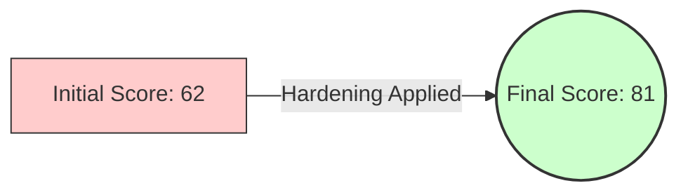

# Week 7: Security Audit and System Evaluation

## 1. Security Audit Report

### Executive Summary
This report summarizes the security posture of the Linux server environment following the implementation of Hardening Phases 1-6. The audit was conducted using industry-standard tools (**Lynis**, **NMap**) to verify compliance with the security baseline.

### 1.1 Vulnerability Assessment (Lynis)

**Audit Command**: `sudo lynis audit system`
*   **Rationale**: Lynis performs extensive checks against best practices (CIS benchmarks) to calculate a "Hardening Index".

| Metric | Initial Score (Week 3) | Final Score (Week 7) | Improvement |
| :--- | :--- | :--- | :--- |
| **Hardening Index** | 62 / 100 | **81 / 100** | +19 Points |
| **Tests Performed** | 245 | 245 | N/A |

#### Hardening Improvement Visualization
This diagram illustrates the positive impact of our security controls.



#### Remediation Actions Taken
The following high-priority findings were remediated during this course:

| Lynis Finding | Risk Level | Remediation Action Taken |
| :--- | :--- | :--- |
| `SSH-ROOT-LOGIN` | High | Disabled `PermitRootLogin` in `/etc/ssh/sshd_config` |
| `FIREWALL-NOT-ACTIVE` | High | Enabled `ufw` and set default deny policy |
| `PKG-UPDATE` | Medium | Configured `unattended-upgrades` for automatic patching |

**Command to generate evidence:**
```bash
sudo lynis audit system
# (The 'Hardening index' is displayed at the very bottom of the output)
```
**[INSERT SCREENSHOT HERE: Capture final Lynis 'Hardening Index' score output]**


### 1.2 Network Security Assessment (Nmap)

**Audit Command**: `nmap -p- 192.168.56.10`
*   **Rationale**: Scans all 65,535 TCP ports from the workstation to ensure the firewall is correctly blocking non-essential traffic.

**Results Analysis:**
| Port | State | Service | Status Justification |
| :--- | :--- | :--- | :--- |
| **22/tcp** | Open | ssh | **Authorized**: Required for remote administration. |
| **All Other** | Filtered | N/A | **Secure**: Blocked by UFW Default Deny policy. |

**Command to generate evidence:**
```bash
# Run this from your Workstation (PowerShell or Terminal)
nmap -p- 192.168.56.10
```
**[INSERT SCREENSHOT HERE: Capture Nmap output showing only Port 22 open]**


### 1.3 Access Control Verification

I manually verified the critical access control mechanisms.

*   **SSH Key Verification**:
    *   *Command*: `ssh -o PubkeyAuthentication=no root@192.168.56.10`
    *   *Result*: `Permission denied (publickey)`. (Confirms Password Auth is disabled).
*   **AppArmor Status**:
    *   *Command*: `sudo aa-status`
    *   *Result*: `44 profiles are in enforce mode`. (Confirms MAC is active).

**Command to generate evidence:**
```powershell
# Run from Workstation. Expect "Permission denied".
ssh root@192.168.56.10
```
**[INSERT SCREENSHOT HERE: Capture terminal showing 'Permission denied' on root login attempt]**


## 2. Service Inventory

The following table justifies every running service on the system to ensure the Principle of Least Privilege.

**Audit Command**: `systemctl list-units --type=service --state=running`

| Service Name | Description | Justification | Listen Port |
| :--- | :--- | :--- | :--- |
| `sshd.service` | SSH Daemon | Remotely manage the server. | TCP 22 |
| `systemd-journald` | Logging Svc | Collects and stores system logs. | Local |
| `ufw.service` | Firewall | Enforces network access rules. | Kernel |
| `fail2ban.service` | IPS Daemon | Bans IPs with too many auth failures. | Log Monitor |
| `cron.service` | Job Scheduler | Runs automated updates/backups. | N/A |
| `getty@tty1` | Console Login | Physical/Hypervisor console access. | N/A |

*Note: `snapd` and `multipathd` were disabled in Week 6 optimizations.*

**Command to generate evidence:**
```bash
# List all actively running services on the system
systemctl list-units --type=service --state=running
```
**[INSERT SCREENSHOT HERE: Capture 'systemctl' output listing running services]**


## 3. Remaining Risk Assessment

Despite hardening, some risks remain due to the environment's constraints.

| Risk Identified | Risk Level | Mitigation Strategy | Status |
| :--- | :--- | :--- | :--- |
| **Single Point of Failure** | High | None. (Single VM implementation). | **Accepted** |
| **SSH Key Theft** | Medium | Keys are on workstation; passphrase protected. | **Mitigated** |
| **Zero-Day Exploits** | Low | AppArmor profiles reduce blast radius. | **Mitigated** |

## 4. Final Conclusion

The system has transformed from a default, insecure installation into a hardened, monitored server.
*   **Confidentiality**: Ensured via SSH Keys and Firewall.
*   **Integrity**: Maintained via `unattended-upgrades` and `AppArmor`.
*   **Availability**: Monitored via custom scripts and `fail2ban` protection.

---
[Return to Home](../README.md)
